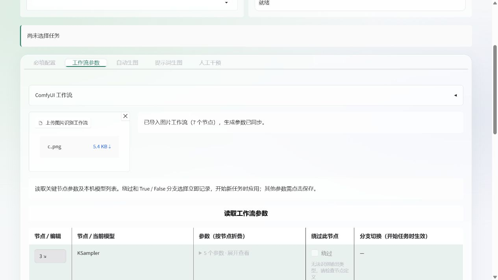
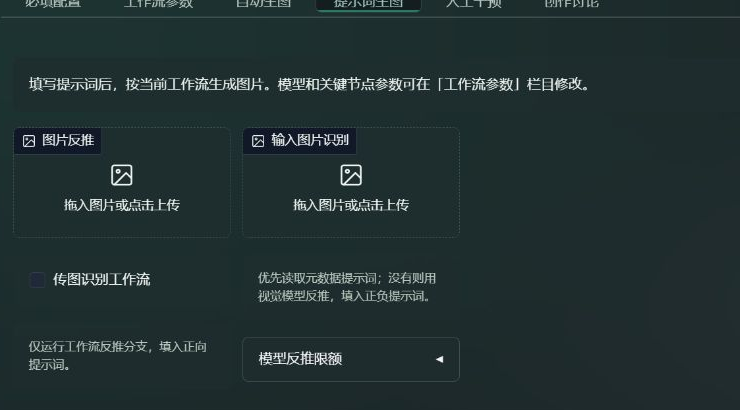

# ComfyUI Supervisor

把参考图分析、提示词设计、本地 ComfyUI 生图、质量评审和交付放在一个界面里的 Python 桌面工具。支持直接填写提示词生图，也支持云端模型自动规划与迭代；任务在本机顺序排队，图片和运行记录保存在本机。

当前版本：**0.1.0 / Beta**。主要验证环境为 **Windows、Python 3.13**；GitHub Actions 配置 Windows Python 3.11 / 3.13 回归测试。需要自行运行 ComfyUI 并安装工作流使用的模型。直接生图且关闭评审时无需云端 API。

自动任务按「规划 → 生图 → 原图评审 → 必要时独立复核 → 保存或迭代 → 交付」运行，不要求逐张人工审批。功能流程已完成本机回归验证；真实视觉评分准确率、个人审美匹配和控制词在成图中的体现仍取决于模型与工作流，目前以 Beta 发布。

## 能做什么

- **自动生图**：参考图片或文件夹抽样、提示词写法分析、分组主题、按组角色、控制词和 LoRA 触发词；按组生成、评分、迭代与保存。未声明角色或触发词时，规划要求各组变化发色、瞳色、发型等外观，并适配本组风格。
- **自动复核与交付**：结构异常、判断矛盾、评分缺项等疑点使用原图再次评审，独立复核不接收初次分数或指控；达标后自动保存，确认缺陷后继续迭代，达到限额时交付已有合格图并说明不足。
- **提示词生图**：填写正负提示词与参数，选择生成张数及是否评审。
- **创作讨论**：只与已配置的提示词模型讨论画面需求；完整提示词可一键应用到生图页，图片详情也可带入当前图提示词。
- **工作流配置**：导入 API JSON、读取 ComfyUI 执行记录，或从原图元数据导入；编辑节点参数、添加已安装的 LoRA、选择绕过和布尔分支。
- **图片详情**：点击图片查看自身的评分、提示词、参数；页面内放大、下载、删除、批量产出、转到提示词生图及人工不满意后重画。
- **任务与交付**：进度、预算、轮数、持久队列与中断恢复；已结束组可独立重绘，执行中和未执行组可取消。默认直接保存图片，ZIP 可选。图库最多载入最近 50 张，可包含历史任务。
- **本轮共享优化**：后续组继承五官、手部、结构等通用修正方向，各组保留自己的主题与控制词。

## 安装与启动

Windows 可直接双击项目根目录的 **start.bat**。第一次会准备环境和安装依赖；启动后打开 <http://127.0.0.1:7860>，运行期间保持终端窗口打开。若应用已在该端口运行，会直接打开现有页面。启动失败时窗口保留错误提示。

在 CMD 中也可使用 `start.bat -Port 7861` 指定端口，或 `start.bat -Demo` 运行本地演示。PowerShell 用法：

先安装 **Python 3.11+**。下载并解压本项目，或克隆仓库；进入含 pyproject.toml 的项目目录。Windows 下请使用较短的项目与数据路径，例如 C:\Apps\ComfyUI-Supervisor；深层目录可能触发文件路径长度限制。在 Windows PowerShell 运行：

    .\start.ps1

脚本会建立独立 .venv、安装依赖，并在依赖声明改变后更新。打开 <http://127.0.0.1:7860>。端口冲突时使用：

    .\start.ps1 -Port 7861

如果系统执行策略阻止脚本，直接运行这些命令即可：

    python -m venv .venv
    .\.venv\Scripts\python.exe -m pip install -e .
    .\.venv\Scripts\python.exe -m supervisor serve --port 7860

终端命令默认在**当前目录**保存配置和数据，也可用 --root 明确指定项目目录，用 --data 指定数据目录。服务仅监听本机，不启用公开分享；一个数据目录同时运行一个服务。其他系统可以尝试手动安装，文件夹选择器和浏览器交互以 Windows 验证结果为准。

## 第一次使用

1. 启动 ComfyUI。在「必填配置」填写地址，导入自己的 **API 格式工作流 JSON**，或在「工作流参数」上传带元数据的原图。
2. 在「工作流参数」读取节点和本机模型列表，确认模型、尺寸、步数及采样器。示例工作流的模型名是占位值，需要替换成已安装模型。
3. 想先验证本地生图，进入「提示词生图」，填写正负提示词、选择输出目录、关闭质量审查，再点击开始。
4. 要使用自动规划或云端评审，再配置 API 端点、Key、提示词/视觉模型和确认的内容范围。保存连接会发送小型测试请求，可能产生 API 费用；同步模型目录不代表模型已经支持视觉或严格 JSON Schema。
5. 自动生图选择参考图片或文件夹，填写共同要求、组数、每组张数及可选主题/控制词/角色。主题不足时模型补足，超出时抽选，留空则随机设计。
6. 选择输出目录、合格分数线、预算及轮数等限额并开始。程序自动评审、必要时复核和交付；新任务等待时仍可查看历史图片。达到限额不保证凑齐目标张数，会保留已交付结果。

完整操作说明见 [使用指南](docs/streamlined-studio.md)，发布包检查见 [发布说明](docs/release.md)。

「创作讨论」位于「人工干预」右侧，支持多轮消息、本机讨论记录和完整提示词选择。它只发送文本，不读取图片或操作工作流。讨论使用独立预算并显示费用；应用后仍需在提示词生图页点击开始。图片详情中的「转到创作讨论」与「转到提示词生图」等大并排，带入所选图本轮正负提示词，等待你补充需求并发送。

控制词可按行指定「全部」或多个组号，如 `1，3,5`；同一行的 tags 共用权重，留空由模型选择，填写 0.1–3 后锁定。程序在本地把该组控制词写入最终正向提示词；这保障文本传递，不等于成图已逐条满足要求。控制角色也可逐行指定组号与角色名称，留空组号应用到所有组。明确角色、触发词和外观要求优先于自动外观变化；角色补充依赖模型已有知识，不联网查询。

## 从原图读取工作流

「工作流参数」提供紧凑的「上传图片识别工作流」入口。提示词页在图片反推入口下提供「传图识别工作流」勾选项，启用后读取原始文件，导入工作流并填入正负提示词、尺寸、步数、CFG、种子、采样器与调度器；无需独立反推节点。

支持保留 ComfyUI 元数据的 PNG、WebP、JPEG；推荐使用原始 PNG。截图、转存或压缩后的图片可能没有元数据。仅含编辑器布局、缺少执行图的图片无法自动导入；失败会显示原因，保留已有配置。未勾选时使用现有工作流的独立反推分支。

提示词页另有并排的小号「输入图片识别」入口：优先从原文件的 ComfyUI 执行图、文本提示词或常见 parameters 元数据读取正负提示词，直接回填，不更换工作流、不调用模型。没有可读取的提示词时，使用已配置的视觉模型（沿用视觉打标路由）反推并回填，结果标明为推测描述，不保证恢复原始提示词。模型反推使用提示词页确认的内容范围和独立限额，默认预算上限 0.10 USD、5000 token，在顺序队列执行；失败保留已有提示词。

图片上传入口统一图标与简短文案；拖到标题、边框或已有文件预览上也可接收，单文件框支持直接拖入新文件替换。拖入时高亮落点，格式不符、文件过大或入口未启用会明确提示；错误格式不会清除已有文件或提示词。也可点击上传，文件仍经过服务端校验。

自动绑定支持单 KSampler、CLIPTextEncode、EmptyLatentImage / EmptySD3LatentImage 与 SaveImage，并支持已识别的字符串连接与潜空间布尔分支。多 sampler、复杂条件和其他自定义节点需要在高级配置指定绑定，程序会提示无法识别的部分。

## 评分与输出

默认综合合格线为 **42**，可以自定义；解剖、结构和手部的明显畸形数值线同为 42。是否保存还会检查结构异常、内容范围、重复及必需评分完整性，综合高分不能抵消明确异常。普通遮挡、画外裁切与风格化简化本身不算畸形，轻微绘画建议也不必然拦截。

自动任务遇到结构异常、低结构分、矛盾或缺乏依据的人体疑点、必需评分缺项等，会按原任务预算再评审原图。独立复核不传旧分数或指控，要求核对可见肢体连接、部位归属、握持关系和构图，再给出最终判定；每张图最多保存一次有效复核结果，中断后复用已保存结果。原始评分记录保留，不人为抬分。达标图自动交付，确认缺陷或复核后仍缺少必需评分时继续迭代；历史人工模式保留原审批操作。

自动任务无需逐张点击接受或拒绝。重新评审、重画与删除是可选操作；受保护图片复查失败时保留原图并排除合格交付。格式错误、连接失败或模型拒答等运行异常仍可能暂停，并显示原因。模型复核增加的调用计入既有预算，不能保证误判被消除。当前没有逐个控制词对应的成图硬性验收，综合达标也不保证每项要求或个人审美都已满足。

两种界面生图方式都需要输出目录。默认把图片直接写进所选目录，文件名带任务与组标识；可以在开始前选择 ZIP，或生成后打包。详细评分、提示词和审计记录保留在本机 data/，不会作为新界面任务的额外交付文件写入所选目录。

「结束本轮工作」取消等待任务，让已提交的当前图片处理完后结束；「执行剩余队列」处理仍排队的任务；「恢复当前任务」沿用暂停任务进度。旧自动任务中的待审、候选图在恢复后优先用已有最终评审或原图复核处理；已结束为「部分完成」且仍有待处理原图的自动审查任务继续原任务，沿用原预算与限额。运行中或已结束的任务也可「再生成一轮」，独立追加到队列。服务更新或重启不会自行恢复暂停与旧等待任务。

结果页「各组进度」只列实际执行与等待队列，重复组号分别显示，当前组有主题色底线。已运行结束的组显示重绘按钮，沿用该组最后一轮图片的提示词、工作流和目标张数，创建独立任务，原图保留；运行中与未运行组显示删除按钮，取消该组后续工作。图片删除键会删除应用管理的原图、缩略图与交付副本，ComfyUI 服务端输出和原始参考文件保留。

## 配置与数据

配置模板见 config/*.example.yaml；自己的配置使用 .local.yaml，上次设置和方案存放在 config/。这些运行文件、工作流快照、.env、数据库、图片缓存和虚拟环境已加入 Git 忽略规则。

API Key 默认仅在服务内存中持有，重启后需重新输入；可选择系统凭据库跨重启保存。也可参考 .env.example 使用环境变量。密钥不写入数据库、配置或浏览器本地存储。服务端点的内容范围和模型能力需要自己确认。

预算以美元微单位记录，用户填写定价与单次调用保守上限。请求前预留额度，返回 usage 后结算；超时和未知 usage 保留待结算费用。达到预算、token、轮数、次数或运行时长限制会停止继续投递并保留已有结果。模型拒答或无法确认 ComfyUI 提交结果时暂停，不盲目重提。

基础模糊与感知哈希检查在本机运行；不在本机运行评审大模型。可选学习指标需要额外依赖和本地权重，默认不启用。SQLite 数据没有应用级加密。原图 PNG 保存对应执行图元数据，可用于恢复工作流。

## 开发与自测

    .\.venv\Scripts\python.exe -m pip install -e ".[test]"
    .\.venv\Scripts\python.exe -m pytest -q
    .\.venv\Scripts\python.exe -m supervisor schemas
    .\.venv\Scripts\python.exe tools/build_release.py --check
    .\.venv\Scripts\python.exe tools/build_release.py

测试使用隔离数据库、模拟云端和 ComfyUI，不消耗真实生图或付费 API。schemas/ 来自 Pydantic 契约，CI 会检查是否漂移。Windows 启动脚本也支持 -Test。

截至 **2026-10-06**，本机 Python 3.13 完整回归 **622 项通过**，覆盖规划、控制词传递、自动复核、评审 JSON 兼容、图片元数据/模型反推、拖放上传、预算限制、原图恢复、文件保护、交付与界面行为。这是流程与边界验证，不能作为真实评分准确率或成图质量的证明；Windows Python 3.11 / 3.13 的远端检查见 [GitHub Actions](https://github.com/aatymmsy/ComfyUI-Supervisor/actions/workflows/checks.yml)。

    python -m supervisor demo

这是明确的 CPU 山景流程演示，不调用云端/ComfyUI，不能证明真实生图质量。它与真实界面任务分开显示。其他命令：status 查看任务、backup 一致性备份数据库、cleanup --task TASK_ID 执行任务配置的延迟清理。

## 当前边界

提供 OpenAI-compatible Chat Completions 和 Responses 适配；Anthropic/Gemini 原生协议、模型目录自动分页、复杂工作流通用转换、多用户部署、自动高分辨率二阶段流程和偏好训练尚未实现。角色基本特征由提示词模型已有知识补充，未接联网搜索。云端模型、接口及 ComfyUI 自定义节点的兼容性仍需用自己的配置验证。

后续验证重点是用真实图片衡量结构误判、评分排序和要求符合度，并检查不同模型与工作流的表现。当前可以作为功能完整的本机 Beta 使用，不承诺无人介入时每张交付图都达到主观高质量。

## 许可证

[MIT](LICENSE)。模型权重、LoRA、参考图片和第三方服务适用各自的许可；本项目不附带它们。
